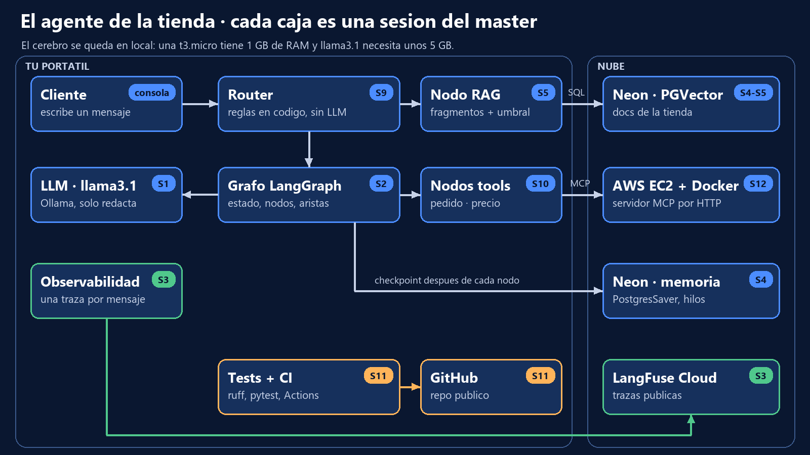

# agente-tienda · el asistente de una tienda online

Proyecto final del **Master AI Engineer** (The Power, Sesión 13). Un agente conversacional que atiende a los clientes de una tienda online ficticia: consulta pedidos, convierte precios a otras monedas, responde con los documentos de la tienda (envíos, tallas, garantía y devoluciones) y **recuerda** cada conversación aunque cierres el programa.

No hay ninguna tecnología nueva: cada pieza es una sesión del curso, y el grafo de LangGraph es el pegamento que las une.



## Qué hace cada pieza

| Pieza | Tecnología | Sesión | Fichero |
|---|---|---|---|
| Orquestación | LangGraph: estado, nodos y aristas condicionales | S1-S2 | `agente.py` |
| Router | Reglas en código (el LLM propone, el código dispone) | S9 | `router.py` |
| Memoria persistente | `PostgresSaver` de LangGraph sobre PostgreSQL (Neon) | S4 | `agente.py` |
| RAG | PGVector + `paraphrase-multilingual-MiniLM-L12-v2` | S4-S5 | `rag.py`, `docs/` |
| Herramientas | Servidor MCP propio por Streamable HTTP | S10 | `herramientas.py` + repo [mcp-server-ci](https://github.com/ignaciothepower/mcp-server-ci) |
| Observabilidad | LangFuse Cloud: una traza por mensaje, con cada nodo | S3, S11 | `agente.py` |
| Calidad | ruff + pytest (LLM falso, memoria en RAM) + GitHub Actions | S11 | `tests/`, `.github/workflows/ci.yml` |
| Despliegue | El servidor MCP en una EC2 t3.micro con Docker | S12 | `aws/` |
| LLM | llama3.1 en local con Ollama | S1 | `config.py` |

## Por qué un router y no "tool calling"

En la S10 vimos que llama3.1 (8B) no encadena herramientas: llamó a dos a la vez y rellenó un importe con el texto `"importe en euros"`. Aquí el **código** decide el camino (`router.py`, reglas probadas con pytest) y el LLM solo redacta la respuesta con los datos que le damos. Así, "¿y eso cuánto es en dólares?" funciona: el importe sale del último pedido guardado en la memoria, no de la imaginación del modelo.

## Cómo ejecutarlo

Necesitas Python 3.10+, [Ollama](https://ollama.com) con `llama3.1`, una base de datos gratuita en [Neon](https://neon.tech) (la de la S4) y tus claves de [LangFuse Cloud](https://cloud.langfuse.com) (las de la S3).

```bash
python -m venv .venv
.venv\Scripts\activate            # en Mac/Linux: source .venv/bin/activate
pip install -r requirements.txt
copy .env.example .env            # y rellena tus valores (NUNCA subas el .env)
python rag.py --indexar           # una vez: mete los documentos de docs/ en PGVector
```

El agente necesita el servidor MCP de la tienda. En local, desde la carpeta de `mcp-server-ci`:

```bash
set MCP_TRANSPORT=http
python server.py
```

Y ya puedes hablar con él:

```bash
python agente.py --hilo ana "Hola, soy Ana. ¿Cuándo llega mi pedido 1234?"
python agente.py --hilo ana "¿Y eso cuánto es en dólares?"
python agente.py --hilo ana --historial
```

## Desplegar el servidor MCP en AWS

Desde AWS CloudShell (sin access keys), con el repositorio clonado:

```bash
export PORTATIL_IP=<la IP de tu portátil>
bash aws/desplegar_mcp.sh      # EC2 t3.micro + Docker; al final te dice la MCP_URL
bash aws/apagar.sh             # SIEMPRE al acabar: todo a 0
```

Pon la `MCP_URL` que te devuelve en tu `.env` y el agente usará las herramientas en la nube. El "cerebro" (LangGraph + llama3.1) se queda en tu portátil: una t3.micro tiene 1 GB de RAM y un LLM de 8B necesita unos 5 GB. Para tenerlo todo en la nube habría que cambiar el LLM local por una API (por ejemplo Gemini, capa gratuita) y desplegar el agente también.

## Tests y CI

```bash
ruff check . && ruff format --check . && pytest -v
```

Los tests no usan Ollama, Neon ni la red: comprueban las reglas del router, el cableado del grafo, la memoria entre turnos y que dos clientes no comparten conversación. En cada push, GitHub Actions ejecuta lo mismo y un segundo job comprueba que las claves de LangFuse llegan desde los Secrets.

## Estructura

```
agente.py         grafo, memoria, LangFuse y la consola
router.py         reglas de decisión (sin LLM)
rag.py            indexar y recuperar en PGVector
herramientas.py   cliente MCP por HTTP
config.py         variables de entorno
docs/             los documentos de la tienda (ficticios)
tests/            pytest
aws/              desplegar y apagar el servidor MCP en AWS
```

Material docente de The Power. La tienda, sus pedidos y sus políticas son ficticios.
